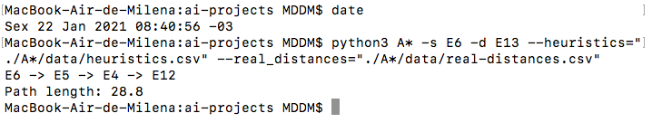

# Tarefa de Laboratório - Busca A*

**Disciplina**: Laboratório de Inteligência Artificial
**Professor**: Rogério Martins Gomes
 **Alunos**:
Marcelo Ferreira Cândido
Milena Delarete D Marques

## Objetivo

Represente a operação da busca A* aplicada ao problema do metrô de Paris

## Execução do algoritmo

### 1. Faça o download do repositório e na raiz dele instale os pacotes necessários:
```
pip3 install -r ./A\*/requirements.txt
```

### 2. O algoritmo funciona com o comando:
```
python3 A* -s <souce-station> -d <destiny-station> --heuristics=<heuristics-file> --real_distances=<distances-file>
```
Em que:
- `<source-station>` é a estação inicial. Exemplo: `E6`
- `<destiny-station>` é a estação de destino. Exemplo: `E13`
- `<heuristics-file>` é o arquivo com os dados de distâncias diretas entre as estações de metrô.
- `<distances-file>` é o arquivo os dados de distâncias reais entre as estações de metrô.

O comando `python3 A* -h` mostra a estrutura do comando vista acima.

O caminho e seu custo são retornados pelo comando.

## Execução da atividade

Para determinar o custo para o seguinte caso: 
$E_{inicial}$ = estação 6 linha azul  
$E_{final}$ = estação 13 linha vermelha

Use o comando:
```
python3 A* -s E6 -d E13 --heuristics="./A*/data/heuristics.csv" --real_distances="./A*/data/real-distances.csv"
```
O resultado será impresso na tela, como pode ser visto na imagem:


## Versão do Python utilizada

Dois computadores foram usados para rodar esse algoritmo e as versão utlizadas foram `3.7.4` e `3.9.1
