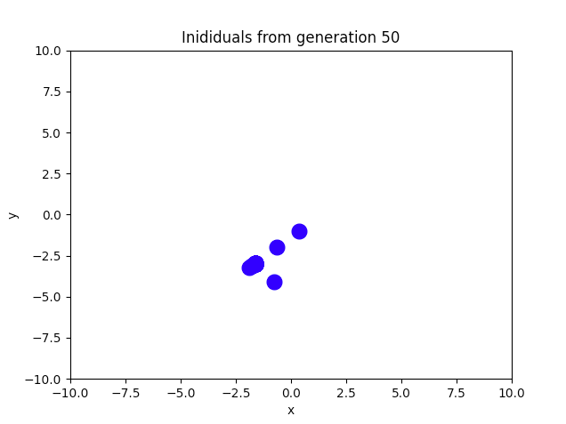
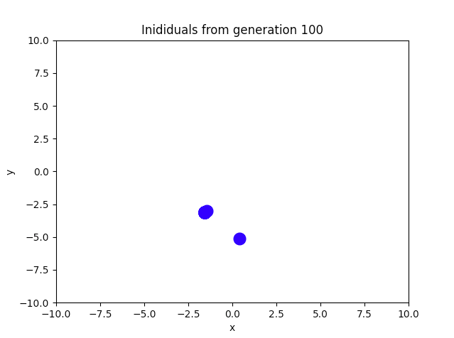
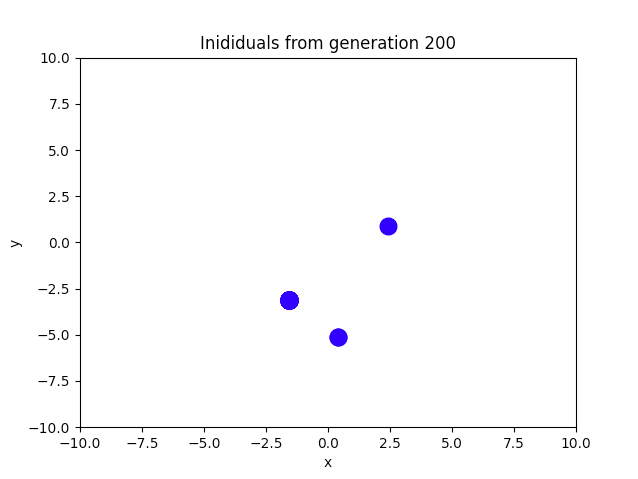
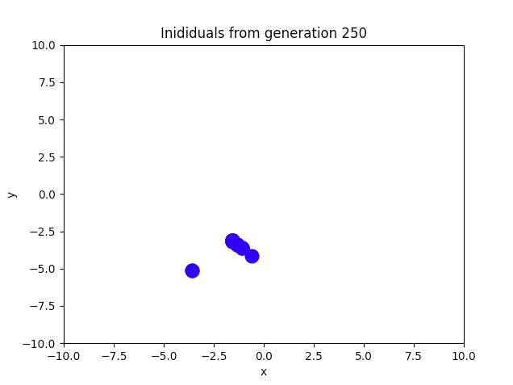

# Tarefa 6 - Algoritmos Genéticos

**Disciplina**: Laboratório de Inteligência Artificial

**Professor**: Rogério Martins Gomes

**Alunos**:
Marcelo Lopes de Macedo Ferreira Cândido
Milena Delarete Drummond Marques

## Objetivo

O objetivo desta atividade é implementar um algoritmo genético para resolver um problema de minimização da função:
<div style="display: flex; justify-content: center">
  
</div>

## Execução do algoritmo

### 1. Configuração:
Na raiz do projeto, execute o seguinte comando para instalar as dependências necessárias:
```
pip3 install -r "./requirements.txt"
```

### 2. Funcionamento:
O comando `python3 minimization-genetic-algorithm -h` mostra como usar o pacote, como visto na seguinte saída:
```bash
Perceptron usage:

python3 minimization-genetic-algorithm -p <pop-size> -m <mutation-rate>
```
Em que:
- `<pop-size>`: tamanho da populacao. Exemplo: `20`
- `<mutation-rate>`: taxa de mutacao. Ideal entre `0.001` e `0.01`

## Exemplo

Para determinar o custo para `<pop-size>` = 20 e `<mutation-rate>` = 0.005, use o comando:
```bash
python3 minimization-genetic-algorithm -p 20 -m 0.005
```

O resultado a ser impresso na tela será:
```
Generation: 0
Generation: 50
Generation: 100
Generation: 150
Generation: 200
Generation: 250
Generation: 267
Best individual and fitness: [-1.58214947 -3.13022245], -106.76453666013647
```

**OBS.:** O resultado pode variar pois, ao executar o programa, a populacao inicial é gerada aleatoriamente. 

## Gráficos obtidos no exemplo acima:












## Informações
| Dado                 | Valor                                                              |
|----------------------|:------------------------------------------------------------------:|
| Tamanho da população |                                 200                                |
| Forma de seleção     |                        Pelo menor valor da                         |
| Tipo de crossover    |                         Crossover de Media*                        |
| Função objetivo      |                          minimizar 𝑓(𝑥,𝑦)                          |
| Função de Fitness    | 𝑓(𝑥,𝑦) = sin(𝑥)e^((1−cos(𝑦))^2) + cos(𝑦)e^((1−sin(𝑥))^2) + (𝑥−𝑦)^2 |
| Número de Gerações   |                                 127                                |
| Taxa de Crossover    |                                                                    |
| Taxa de Mutação      |                                0.005                               |

\* Função crossover explicada em um item abaixo

## Indivíduos
Os indivíduos do algoritmo genético foram modelados por arrays da biblioteca numpy com dimensão 1x2, de forma que a primeira posição do array corresponde ao valor 𝑥 e a segunda ao valor de 𝑦.

## Função de Seleção
A função de seleção escolhida foi uma função randomica.

## Função Crossover
Duas funções de crossover foram testadas: crossover uniforme e crossover de média.
A função escolhida para fazer o crossover foi o crossover de média em que um indvíduo filho é criado usando a média dos parâmetros dos pais:
```
c1 = [(parent1[0] + parent2[0])/2, (parent1[1] + parent2[1])/2]
```
Para manter a população de forma que dois pais geram dois filhos, além do filho gerado pela média, foi mantido também o pai que obtivesse o melhor valor da função fitness (nesse caso, o menor valor).

## Função de mutação
Nesse programa, a mutação ocorre quando a taxa de mutação é maior que um número aleatório gerado para cada indivíduo da nova geração.

A mutação ocorrendo, é sorteado aleatóriamente uma operação a ser realizada e uma potência de 2 (entre 0 e 3 a ser usada).
As opções de operação são:
- 0: ocorre soma da potência de 2 tanto no valor de 𝑥 quanto no valor de 𝑦.
- 1: ocorre subtração da potência de 2 tanto no valor de 𝑥 e soma no valor de 𝑦.
- 2: ocorre soma da potência de 2 tanto no valor de 𝑥 e subtração no valor de 𝑦.
- 3: ocorre subtração da potência de 2 tanto no valor de 𝑥 quanto no valor de 𝑦.

### Versões do Python recomendadas

Dois computadores foram usados para rodar esse algoritmo e as versão utlizadas foram `3.7.4` e `3.9.1`.

