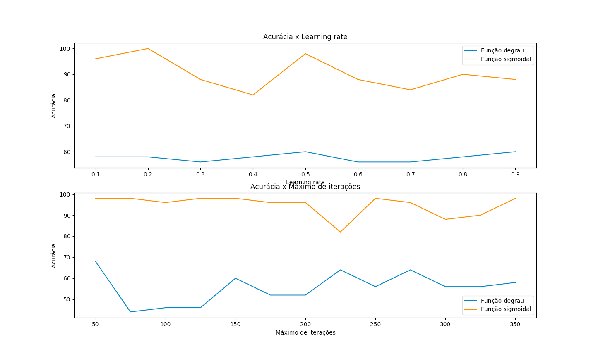

# Tarefa 5 - Redes Neurais

**Disciplina**: Laboratório de Inteligência Artificial

**Professor**: Rogério Martins Gomes

**Alunos**:

Marcelo Lopes de Macedo Ferreira Cândido

Milena Delarete Drummond Marques

## Objetivo

O objetivo desta atividade é implementar um Perceptron para predizer a classe da planta iris.

## Execução do algoritmo

### 1. Configuração:
Na raiz do projeto, execute o seguinte comando para instalar as dependências necessárias:
```
pip3 install -r "./A*/requirements.txt"
```

### 2. Funcionamento:
O comando `python3 perceptron -h` mostra como usar o pacote, como visto na seguinte saída:
```
Perceptron usage:

python perceptron -l <learning-rate> -i <max-iterations> --data-file <data-file>
```
Em que:
- `<learning-rate>`: taxa de aprendizagem. Exemplo: `0.6`
- `<max-iterations>`: número máximo de iterações. Exemplo: `100`
- `<data-file>`: arquivo com os dados usados para treinar o modelo. Exemplo: `../perceptron/data/iris.csv`.

O comando imprime no terminal o número de acertos e a acurácia do algoritmo usando a função degrau e a função sigmoidal.

Em seguida, o programa roda os algoritmos variando os parâmetros e plotando um gráfico de comparação da função degrau e da função sigmoidal. Para evitar que essa função rode, basta comentar a linha 150 do arquivo `__main__.py`.

A variação de parâmetro é feita mantendo o número máximo de interações passado no comando e variando o parâmetro `learning-rate` e, em seguida, fazendo o oposto. De forma que é possível ver a influencia de cada parâmetro separadamente na acurácia do modelo.

## Exemplo

Para determinar o custo para o seguinte caso:

`<learning-rate>` = 0.6

`<max-iterations>` = 300

use o comando:
```
python3 perceptron -l 0.6 -i 300 --data-file ./perceptron/data/iris.csv
```

O resultado a ser impresso na tela será:
```
** Função degrau **
Número de acertos: 35
Acurácia: 70.0%


** Função sigmoidal **
Número de acertos: 36
Acurácia: 72.0%
```

**OBS.:** Os resultados podem variar pois, ao executar o programa, os dados do dataset são embaralhados aleatóriamente. 

## Versões do Python recomendadas

Dois computadores foram usados para rodar esse algoritmo e as versão utlizadas foram `3.7.4` e `3.9.1`.

## Análise dos resultados

Como pode ser visto em no gráfico abaixo, gerado ao rodar o programa, a Função Sigmoidal gera modelos com acurácia muito maior que a Função Degrau.



